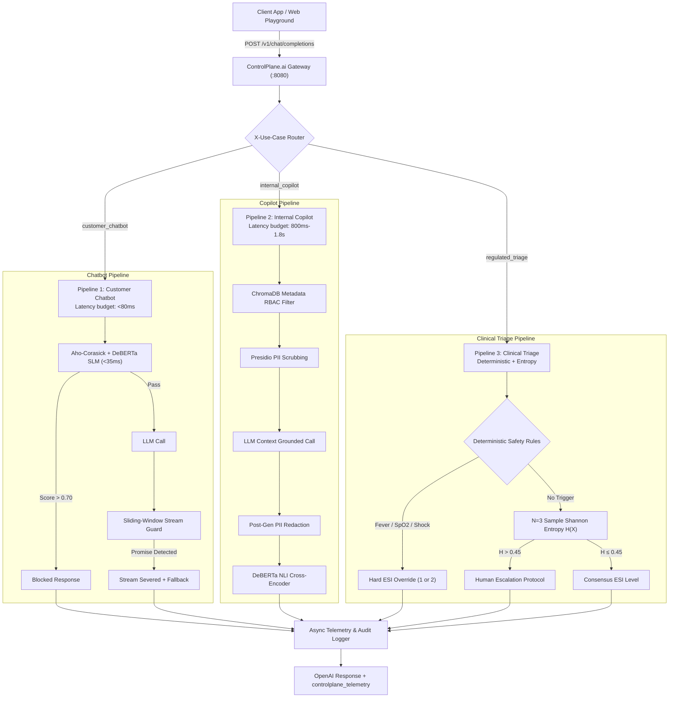

# ControlPlane.ai Architecture & System Design

## 1. High-Level Architecture

ControlPlane.ai acts as an inline, OpenAI-compatible reverse proxy middleware positioned between client applications and downstream foundation models (Groq Llama 3.1, Google Gemini 2.0, or local Mock LLM).

---

## 2. Guard Pipeline Specifications

### 2.1 Customer Chatbot (Commercial Safety & Low Latency)
- **Input Guard**: Aho-Corasick string matching against adversarial patterns + DeBERTa v3 prompt injection scorer ($S_{inj} > 0.70 \rightarrow$ BLOCKED).
- **Stream Interceptor**: 12-token sliding window evaluating n-grams for unauthorized financial promises (e.g. `refund`, `waive fee`, `free voucher`). On detection without supervisor hash, the stream is severed.

### 2.2 Internal Copilot (Data Governance & RBAC)
- **RBAC Filtering**: User roles mapped to clearance (1, 3, 5). Vector retrieval applies `{"clearance_level": {"$lte": user_clearance}}`.
- **PII Guard**: Microsoft Presidio analyzer + anonymizer (and regex engine) scrubs SSN, phone, email, credit cards, and salary values to `[REDACTED_*]`.
- **Grounding Guard**: `cross-encoder/nli-deberta-v3-small` scores each response sentence against retrieved chunks. $p(\text{Contradiction}) > 0.35$ or $p(\text{Neutral}) > 0.50$ triggers hallucination warning tags.

### 2.3 Regulated Clinical Decision Support (ESI Triage)
- **Deterministic Rules**:
  - *Pediatric Fever*: $\text{age} < 3 \text{ AND } \text{temp} \ge 38.5^\circ\text{C} \rightarrow \text{ESI 2}$.
  - *Silent Hypoxia*: $\text{SpO}_2 < 90\% \rightarrow \text{ESI 1}$.
  - *Hypotensive Shock*: $\text{systolic\_bp} < 80 \text{ AND } \text{HR} > 100 \rightarrow \text{ESI 1}$.
- **Entropy Safe Abstention**: When no hard rule triggers, runs $N=3$ samples and computes Shannon entropy:
  $$H(X) = -\sum_{i=1}^k p(x_i) \log_2 p(x_i)$$
  If $H(X) > 0.45$, safe abstention protocol activates (`HUMAN_ESCALATION_REQUIRED`).

---

## 3. Dual-Path Evaluation Harness

The `/api/v1/playground/compare` endpoint executes:
1. **Path A (Unprotected Baseline)**: Raw passthrough directly to the LLM.
2. **Path B (Protected ControlPlane)**: Inline reverse proxy with multi-guard governance.

Returns side-by-side responses and latency diagnostics for immediate visual comparison.
